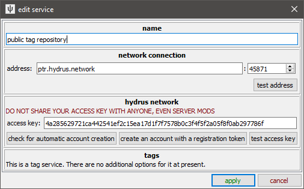
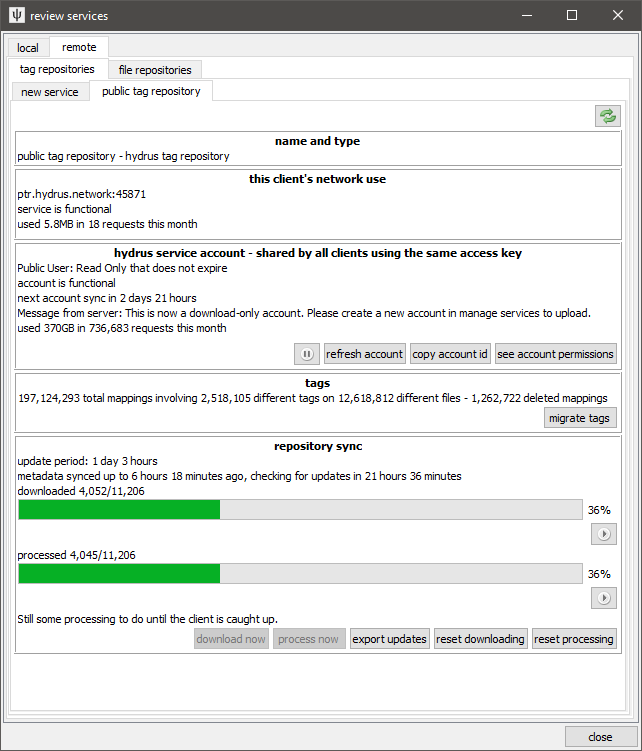

The PTR is now run by users with more bandwidth than I had to give, so the bandwidth limits are gone! If you would like to talk with the new management, please check the [discord](https://discord.gg/wPHPCUZ).

A guide and schema for the new PTR is [here](PTR.md).

## first off

I don't like it when programs I use connect anywhere without asking me, so I have purposely not pre-baked any default repositories into the client. You have to choose to connect yourself. **The client will never connect anywhere until you tell it to.**

For a long time, I ran the Public Tag Repository myself and was the lone janitor. It grew to 650 million tags, and siblings and parents were just getting complicated, and I no longer had the bandwidth or time it deserved. It is now run by users.

There also used to be just one user account that everyone shared. Everyone was essentially the same Anon, and all uploads were merged to that one ID. As the PTR became more popular, and more sophisticated and automatically generated content was being added, it became increasingly difficult for the janitors to separate good submissions from bad and undo large scale mistakes.

That old shared account is now a 'read-only' account. This account can only download--it cannot upload new tags or siblings/parents. Users who want to upload now generate their own individual accounts, which are still Anon, but separate, which helps janitors approve and deny uploaded petitions more accurately and efficiently.

I recommend using the shared read-only account, below, to start with, but if you decide you would like to upload, making your own account is easy--just click the 'check for automatic account creation' button in _services->manage services_, and you should be good. You can change your access key on an existing service--you don't need to delete and re-add or anything--and your client should quickly resync and recognise your new permissions.

## privacy

I have tried very hard to ensure the PTR respects your privacy. Your account is a very barebones thing--all a server stores is a couple of random hexadecimal texts and which rows of content you uploaded, and even the memory of what you uploaded is deleted after a delay. The server obviously needs to be aware of your IP address to accept your network request, but it forgets it as soon as the job is done. Normal users are never told which accounts submitted any content, so the only privacy implications are against janitors or (more realistically, since the janitor UI is even more buggy and feature-poor than the hydrus front-end!) the server owner or anyone else with raw access to the server as it operates or its database files.

Most users should have very few worries about privacy. The general rule is that it is always healthy to use a VPN, but please check [here for a full discussion and explanation of the anonymisation routine](privacy.md).

## a note on resources { id="ssd" }

!!! danger
	**If you are on an HDD, or your SSD does not have at least 64GB of free space, do not add the PTR!**

The PTR has been operating since 2011 and is now huge, more than a billion mappings! Your client will be downloading and indexing them all, which is currently (2021-06) about 6GB of bandwidth and 50GB of hard drive space. It will take _hours_ of total processing time to catch up on all the years of submissions. Furthermore, because of mechanical drive latency, HDDs are too slow to process all the content in reasonable time. Syncing is only recommended if your [hydrus db is on an SSD](database_migration.md). Even then, it is healthier and allows the client to 'grow into' the PTR if the work is done in small pieces in the background, either during idle time or shutdown time, rather than trying to do it all at once. Just leave it to download and process on its own--it usually takes a couple of weeks to quietly catch up. You'll see tags appear on your files as it proceeds, first on older, then all the way up to new files just uploaded a couple days ago. Once you are synced, the daily processing work to stay synced is usually just a few minutes. If you leave your client on all the time in the background, you'll likely never notice it.

## easy setup

Hit _help->add the public tag repository_ and you will all be set up.

## manually

Hit _services->manage services_ and click _add->hydrus tag repository_. You'll get a panel, fill it out like this:



Here's the info so you can copy it:


``` title="address"
ptr.hydrus.network
```
``` title="port"
45871
```
``` title="access key"
4a285629721ca442541ef2c15ea17d1f7f7578b0c3f4f5f2a05f8f0ab297786f
```

Note that because this is the public shared key, you can ignore the '<span class="hydrus-warning">DO NOT SHARE</span>' red text warning.

It is worth checking the 'test address' and 'test access key' buttons just to double-check your firewall and key are all correct. Notice the 'check for automatic account creation' button, for if and when you decide you want to contribute to the PTR.

Then you can check your PTR at any time under _services->review services_, under the 'remote' tab:



## jump-starting an install { id="quicksync" }

A user kindly manages a store of update files and pre-processed empty client databases to get your synced quicker. This is generally recommended for advanced users or those following a guide, but if you are otherwise interested, please check it out:

[https://cuddlebear92.github.io/Quicksync/](https://cuddlebear92.github.io/Quicksync/)