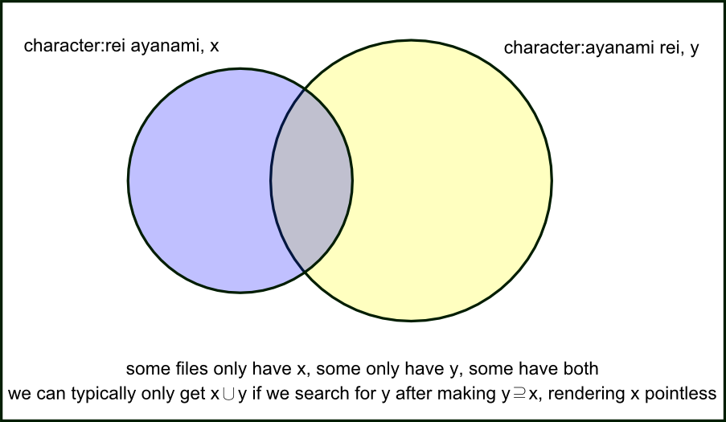
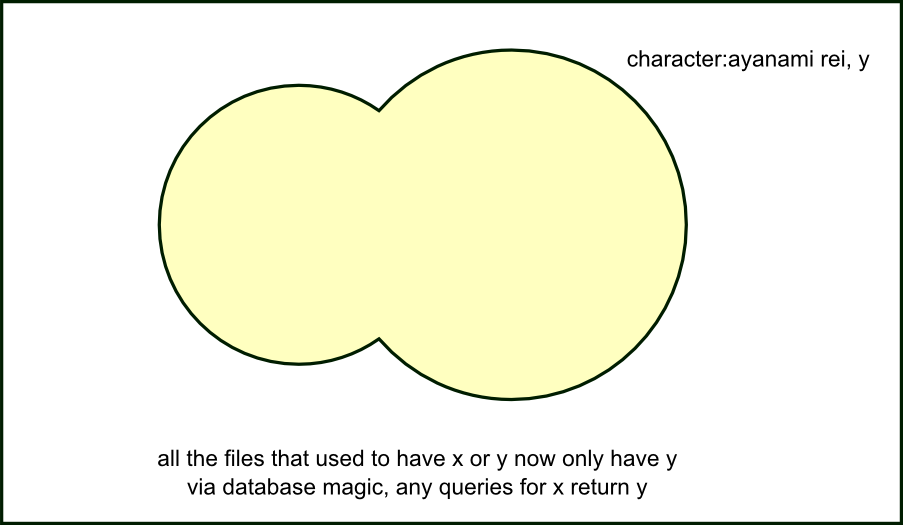
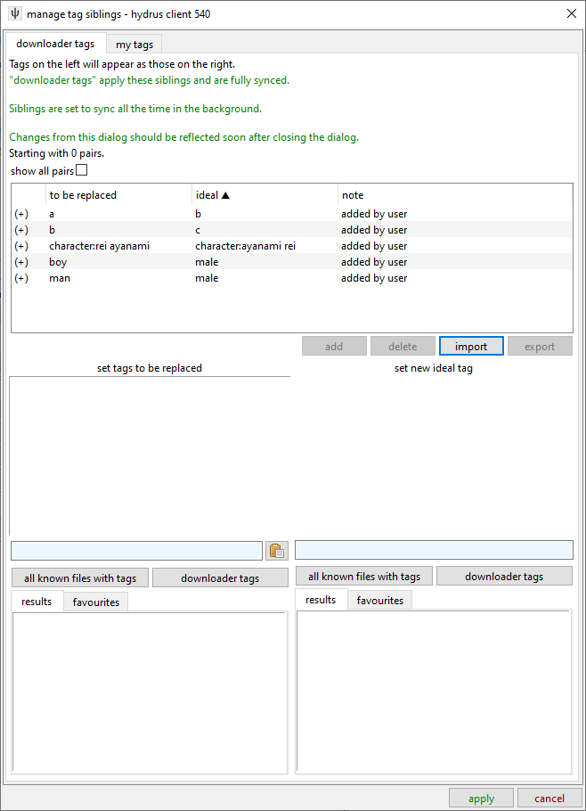
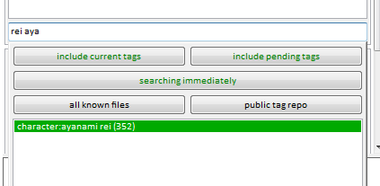
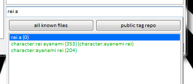

---
title: tag siblings
--- 

Tag siblings let you replace a bad tag with a better tag.

## what's the problem? { id="the_problem" }

Reasonable people often use different words for the same things.

A great example is in Japanese names, which are natively written surname first. `character:ayanami rei` and `character:rei ayanami` have the same meaning, but different users will use one, or the other, or even both.

Other examples are tiny syntactic changes, common misspellings, and unique acronyms:

*   _smiling_ and _smile_
*   _staring at camera_ and _looking at viewer_
*   _pokemon_ and _pokémon_
*   _jersualem_ and _jerusalem_
*   _lotr_ and _series:the lord of the rings_
*   _marimite_ and _series:maria-sama ga miteru_
*   _ishygddt_ and _i sure hope you guys don't do that_

A particular repository may have a preferred standard, but it is not easy to guarantee that all the users will know exactly which tag to upload or search for.

After some time, you get this:

Without continual intervention by janitors or other experienced users to make sure y⊇x (i.e. making the yellow circle entirely overlap the blue by manually giving y to everything with x), searches can only return x (blue circle) or y (yellow circle) or x∩y (the lens-shaped overlap). What we really want is x∪y (both circles).

So, how do we fix this problem?

## tag siblings { id="tag_siblings" }

Let's define a relationship, **A->B**, that means that any time we would normally see or use tag A or tag B, we will instead only get tag B:

Note that this relationship implies that B is in some way 'better' than A.

## ok, I understand; now confuse me { id="more_complicated" }

This relationship is transitive, which means as well as saying `A->B`, you can also say `B->C`, which implies `A->C` and `B->C`.

``` mermaid
graph LR
  A[murrikkka] --> B[united states] --> C[united states of america];
```

You can also have an `A->C` and `B->C` that does not include `A->B`.

```mermaid
graph LR
  boy --> male
  man --> male
```

The outcome of these two arrangements is the same (everything ends up as C), but the underlying semantics are a little different if you ever want to edit them.

Many complicated arrangements are possible:

```mermaid
graph LR
  A[Calvin Broadus] --> B[snoop doggy dogg] --> C[snoop dogg] --> D[snoop lion]
  E[dj snoopadelic] --> D
```

Note that if you say `A->B`, you cannot say `A->C`; the left-hand side can only go to one. The right-hand side can receive many. The client will stop you from constructing loops.

## how you do it { id="how_to_do_it" }

Just open _services->manage tag siblings_, and add a few.

The client will automatically collapse the tagspace to whatever you set. It'll even work with autocomplete, like so:

Please note that siblings' autocomplete counts may be slightly inaccurate, as unioning the _count_ is difficult to quickly estimate.

The client will not collapse siblings anywhere you 'write' tags, such as the manage tags dialog. You will be able to add or remove A as normal, but it will be written in some form of "A (B)" to let you know that, ultimately, the tag will end up displaying in the main gui as B:

Although the client may present A as B, it will secretly remember A! You can remove the association A->B, and everything will return to how it was. **No information is lost at any point.**

## remote siblings { id="remote_siblings" }

Whenever you add or remove a tag sibling pair to a tag repository, you will have to supply a reason (like when you petition a tag). A janitor will review this petition, and will approve or deny it. If it is approved, all users who synchronise with that tag repository will gain that sibling pair. If it is denied, only you will see it.