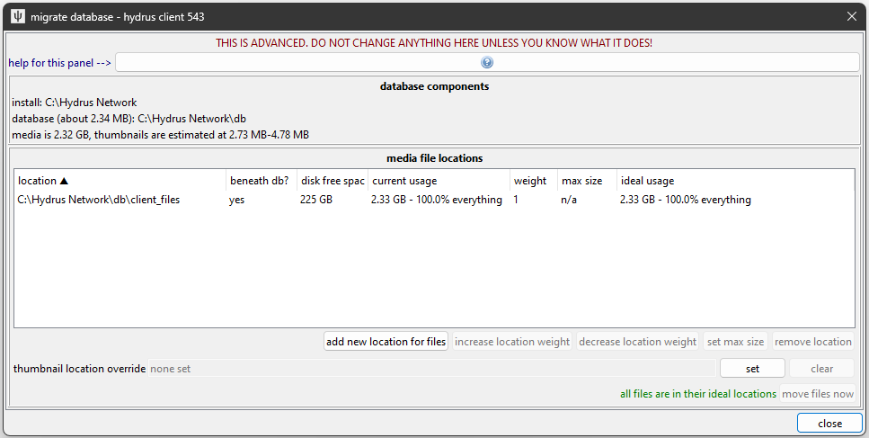
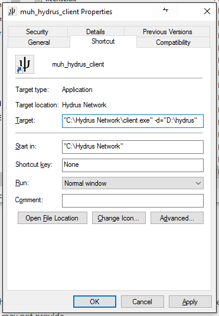
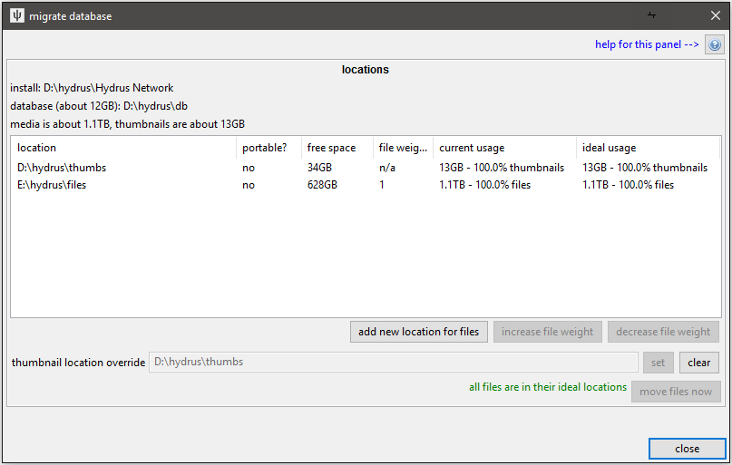

# database migration

## the hydrus database { id="intro" }

A hydrus client consists of three components:

1.  **the software installation**
    
    This is the part that comes with the installer or extract release, with the executable and dlls and a handful of resource folders. It doesn't store any of your settings--it just knows how to present a database as a nice application. If you just run the client executable straight, it looks in its 'db' subdirectory for a database, and if one is not found, it creates a new one. If it sees a database running at a lower version than itself, it will update the database before booting it.
    
    It doesn't really matter where you put this. An SSD will load it marginally quicker the first time, but you probably won't notice. If you run it without command-line parameters, it will try to write to its own directory (to create the initial database), so if you mean to run it like that, it should not be in a protected place like _Program Files_.
    
2.  **the actual database**
    
    The client stores all its preferences and current state and knowledge _about_ files--like file size and resolution, tags, ratings, inbox status, and so on and so on--in a handful of SQLite database files, defaulting to _install_dir/db_. Depending on the size of your client, these might total 1MB in size or be as much as 10GB.
    
    In order to perform a search or to fetch or process tags, the client has to interact with these files in many small bursts, which means it is best if these files are on a drive with low latency. An SSD is ideal, but a regularly-defragged HDD with a reasonable amount of free space also works well.
    
3.  **your media files**
    
    All of your jpegs and webms and so on (and their thumbnails) are stored in a single complicated directory that is by default at _install\_dir/db/client\_files_. All the files are named by their hash and stored in efficient hash-based subdirectories. In general, it is not navigable by humans, but it works very well for the fast access from a giant pool of files the client needs to do to manage your media.
    
    Thumbnails tend to be fetched dozens at a time, so it is, again, ideal if they are stored on an SSD. Your regular media files--which on many clients total hundreds of GB--are usually fetched one at a time for human consumption and do not benefit from the expensive low-latency of an SSD. They are best stored on a cheap HDD, and, if desired, also work well across a network file system.
    

## these components can be put on different drives { id="different_drives" }

Although an initial install will keep these parts together, it is possible to, say, run the database on a fast drive but keep your media in cheap slow storage. This is an excellent arrangement that works for many users. And if you have a very large collection, you can even spread your files across multiple drives. It is not very technically difficult, but I do not recommend it for new users.

Backing such an arrangement up is obviously more complicated, and the internal client backup is not sophisticated enough to capture everything, so I recommend you figure out a broader solution with a third-party backup program like FreeFileSync.

## pulling your media apart { id="pulling_media_apart" }

!!! danger
    **As always, I recommend creating a backup before you try any of this, just in case it goes wrong.**

If you would like to move your files and thumbnails to new locations, I generally recommend you not move their folders around yourself--the database has an internal knowledge of where it thinks its file and thumbnail folders are, and if you move them while it is closed, it will become confused and you will have to manually relocate what is missing on the next boot via a repair dialog. This is not impossible to figure out, but if the program's 'client files' folder confuses you at all, I'd recommend you stay away. Instead, you can simply do it through the gui:

Go _database->migrate database_, giving you this dialog:

This is an image from my old laptop's client. At that time, I had moved the main database and its files out of the install directory but otherwise kept everything together. Your situation may be simpler or more complicated.

To move your files somewhere else, add the new location, empty/remove the old location, and then click 'move files now'.

**Portable** means that the path is beneath the main db dir and so is stored as a relative path. Portable paths will still function if the database changes location between boots (for instance, if you run the client from a USB drive and it mounts under a different location).

**Weight** means the relative amount of media you would like to store in that location. It only matters if you are spreading your files across multiple locations. If location A has a weight of 1 and B has a weight of 2, A will get approximately one third of your files and B will get approximately two thirds.

The operations on this dialog are simple and atomic--at no point is your db ever invalid. Once you have the locations and ideal usage set how you like, hit the 'move files now' button to actually shuffle your files around. It will take some time to finish, but you can pause and resume it later if the job is large or you want to undo or alter something.

If you decide to move your actual database, the program will have to shut down first. Before you boot up again, you will have to create a new program shortcut:

## informing the software that the database is not in the default location { id="launch_parameter" }

A straight call to the client executable will look for a database in _install_dir/db_. If one is not found, it will create one. So, if you move your database and then try to run the client again, it will try to create a new empty database in the previous location!

So, pass it a -d or --db_dir command line argument, like so:

*   `client -d="D:\media\my_hydrus_database"`
*   _--or--_
*   `client --db_dir="G:\misc documents\New Folder (3)\DO NOT ENTER"`
*   _--or, for macOS--_
*   `open -n -a "Hydrus Network.app" --args -d="/path/to/db"`

And it will instead use the given path. If no database is found, it will similarly create a new empty one at that location. You can use any path that is valid in your system, but I would not advise using network locations and so on, as the database works best with some clever device locking calls these interfaces may not provide.

Rather than typing the path out in a terminal every time you want to launch your external database, create a new shortcut with the argument in. Something like this, which is from my main development computer and tests that a fresh default install will run an existing database ok:

Note that an install with an 'external' database no longer needs access to write to its own path, so you can store it anywhere you like, including protected read-only locations (e.g. in 'Program Files'). If you do move it, just double-check your shortcuts are still good and you are done.

## finally { id="finally" }

If your database now lives in one or more new locations, make sure to update your backup routine to follow them!

## moving to an SSD { id="to_an_ssd" }

As an example, let's say you started using the hydrus client on your HDD, and now you have an SSD available and would like to move your thumbnails and main install to that SSD to speed up the client. Your database will be valid and functional at every stage of this, and it can all be undone. The basic steps are:

1.  Move your 'fast' files to the fast location.
2.  Move your 'slow' files out of the main install directory.
3.  Move the install and db itself to the fast location and update shortcuts.

Specifically:

*   Update your backup if you maintain one.
*   Create an empty folder on your HDD that is outside of your current install folder. Call it 'hydrus_files' or similar.
*   Create two empty folders on your SSD with names like 'hydrus\_db' and 'hydrus\_thumbnails'.

*   Set the 'thumbnail location override' to 'hydrus_thumbnails'. You should get that new location in the list, currently empty but prepared to take all your thumbs.
*   Hit 'move files now' to actually move the thumbnails. Since this involves moving a lot of individual files from a high-latency source, it will take a long time to finish. The hydrus client may hang periodically as it works, but you can just leave it to work on its own--it will get there in the end. You can also watch it do its disk work under Task Manager.

*   Now hit 'add location' and select your new 'hydrus\_files'. 'hydrus\_files' should be added and willing to take 50% of the files.
*   Select the old location (probably 'install\_dir/db/client\_files') and hit 'decrease weight' until it has weight 0 and you are prompted to remove it completely. 'hydrus_files' should now be willing to take all the files from the old location.
*   Hit 'move files now' again to make this happen. This should be fast since it is just moving a bunch of folders across the same partition.

*   With everything now 'non-portable' and hence decoupled from the db, you can now easily migrate the install and db to 'hydrus_db' simply by shutting the client down and moving the install folder in a file explorer.
*   Update your shortcut to the new client.exe location and try to boot.

*   Update your backup scheme to match your new locations.
*   Enjoy a much faster client.

You should now have _something_ like this:

## p.s. running multiple clients { id="multiple_clients" }

Since you now know how to tell the software about an external database, you can, if you like, run multiple clients from the same install (and if you previously had multiple install folders, now you can now just use the one). Just make multiple shortcuts to the same client executable but with different database directories. They can run at the same time. You'll save yourself a little memory and update-hassle. I do this on my laptop client to run a regular client for my media and a separate 'admin' client to do PTR petitions and so on.
