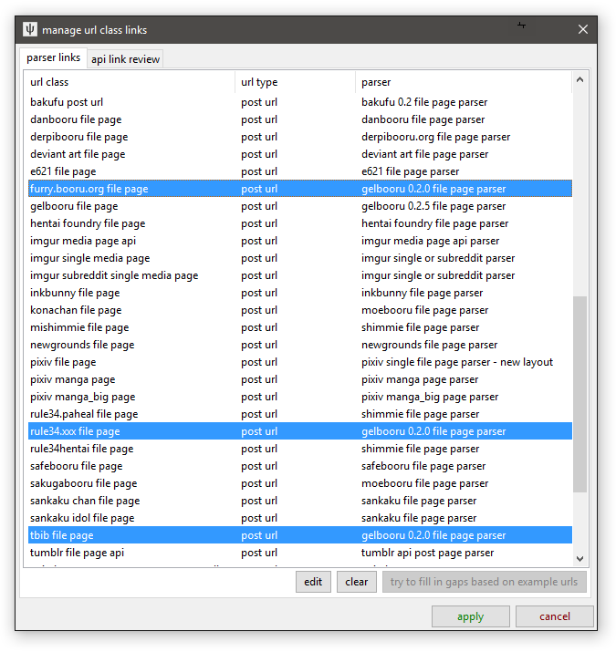

# Putting it all together

Now you know what GUGs, URL Classes, and Parsers are, you should have some ideas of how URL Classes could steer what happens when the downloader is faced with an URL to process. Should a URL be imported as a media file, or should it be parsed? If so, how?

You may have noticed in the Edit GUG ui that it lists if a current URL Class matches the example URL output. If the GUG has no matching URL Class, it won't be listed in the main 'gallery selector' button's list--it'll be relegated to the 'non-functioning' page. Without a URL Class, the client doesn't know what to do with the output of that GUG. But if a URL Class does match, we can then hand the result over to a parser set at _network->downloader components->manage url class links_:

Here you simply set which parsers go with which URL Classes. If you have URL Classes that do not have a parser linked (which is the default for new URL Classes), you can use the 'try to fill in gaps...' button to automatically fill the gaps based on guesses using the parsers' example URLs. This is usually the best way to line things up unless you have multiple potential parsers for that URL Class, in which case it'll usually go by the parser name earliest in the alphabet.

If the URL Class has no parser set or the parser is broken or otherwise invalid, the respective URL's file import object in the downloader or subscription is going to throw some kind of error when it runs. If you make and share some parsers, the first indication that something is wrong is going to be several users saying 'I got this error: (_copy notes_ from file import status window)'. You can then load the parser back up in _manage parsers_ and try to figure out what changed and roll out an update.

_manage url class links_ also shows 'api/redirect link review', which summarises which URL Classes redirect to others. In these cases, only the redirected-to URL gets a parser entry in the first 'parser links' window, since the first will never be fetched for parsing (in the downloader, it will always be converted to the Redirected URL, and _that_ is fetched and parsed).

Once your GUG has a URL Class and your URL Classes have parsers linked, test your downloader! Note that Hydrus's URL drag-and-drop import uses URL Classes, so if you don't have the GUG and gallery stuff done but you have a Post URL set up, you can test that just by dragging a Post URL from your browser to the client, and it should be added to a new URL Downloader and just work. It feels pretty good once it does!
