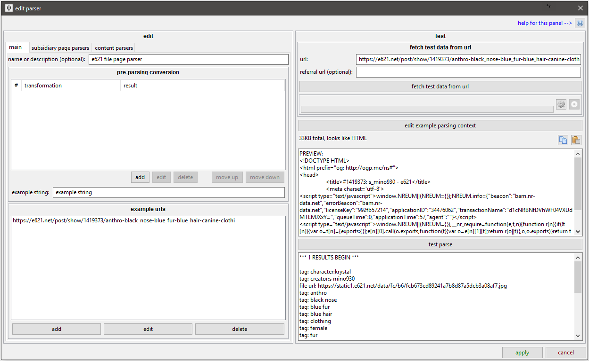
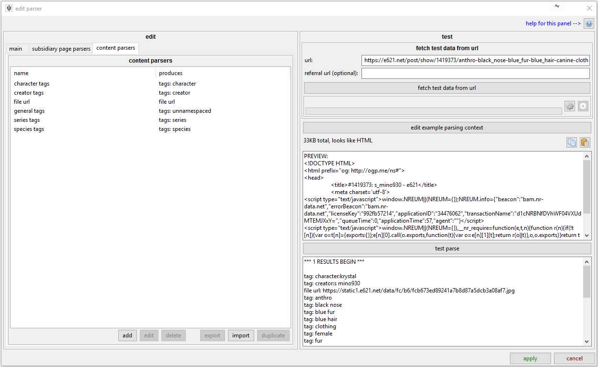

# Page Parsers

We can now produce individual rows of rich metadata. To arrange them all into a useful structure, we will use Page Parsers.

The Page Parser is the top level parsing object. It takes a single document and produces a list--or a list of lists--of metadata. Here's the main UI:



Notice that the edit panel has three sub-pages.

## main { id="main" }

*   **Name**: Like for content parsers, I recommend you add good names for your parsers.
*   **Pre-parsing conversion**: If your API source encodes or wraps the data you want to parse, you can do some string transformations here. You won't need to use this very often, but if your source gives the JSON wrapped in javascript (like the old tumblr API), it can be invaluable.
*   **Example URLs**: Here you should add a list of example URLs the parser works for. This lets the client automatically link this parser up with URL classes for you and any users you share the parser with.

## content parsers { id="content_parsers" }

This page is just a simple list:



Each content parser here will be applied to the document and returned in this page parser's results list. Like most boorus, e621's File Pages only ever present one file, and they have simple markup, so the solution here was simple. The full contents of that test window are:

```
*** 1 RESULTS BEGIN ***

tag: character:krystal
tag: creator:s mino930
file url: https://static1.e621.net/data/fc/b6/fcb673ed89241a7b8d87a5dcb3a08af7.jpg
tag: anthro
tag: black nose
tag: blue fur
tag: blue hair
tag: clothing
tag: female
tag: fur
tag: green eyes
tag: hair
tag: hair ornament
tag: jewelry
tag: short hair
tag: solo
tag: video games
tag: white fur
tag: series:nintendo
tag: series:star fox
tag: species:canine
tag: species:fox
tag: species:mammal

*** RESULTS END ***
```

When the client sees this in a downloader context, it will where to download the file and which tags to associate with it based on what the user has chosen in their 'tag import options'.

## subsidiary page parsers { id="subsidiary_page_parsers" }

Here be dragons. This was an attempt to make parsing more helpful in certain API situations, but it ended up ugly. I do not recommend you use it, as I will likely scratch the whole thing and replace it with something better one day. It basically splits the page up into pieces that can then be parsed by nested page parsers as separate objects, but the UI and workflow is hell. Afaik, the imageboard API parsers use it, but little/nothing else. If you are really interested, check out how those work and maybe duplicate to figure out your own imageboard parser and/or send me your thoughts on how to separate File URL/timestamp combos better.