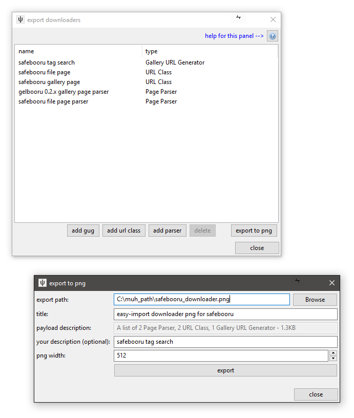

# Sharing Downloaders

If you are working with users who also understand the downloader system, you can swap your GUGs, URL Classes, and Parsers separately using the import/export buttons on the relevant dialogs, which work in pngs and clipboard text.

But if you want to share conveniently, and with users who are not familiar with the different downloader objects, you can package everything into a single easy-import png as per [here](adding_new_downloaders.md).

The dialog to use is _network->downloader definitions->export downloaders_:

It isn't difficult. Essentially, you want to bundle enough objects to make one or more 'working' GUGs at the end. I recommend you start by just hitting 'add gug', which--using Example URLs--will attempt to figure out everything you need by itself.

This all works on Example URLs and some domain guesswork, so make sure your url classes are good and the parsers have correct Example URLs as well. If they don't, they won't all link up neatly for the end user. If part of your downloader is on a different domain to the GUGs and Gallery URLs, then you'll have to add them manually. Just start with 'add gug' and see if it looks like enough.

Once you have the necessary and sufficient objects added, you can export to png. You'll get a similar 'does this look right?' summary as what the end-user will see, just to check you have everything in order and the domains all correct. If that is good, then make sure to give the png a sensible filename and embellish the title and description if you need to. You can then send/post that png wherever, and any regular user will be able to use your work.
