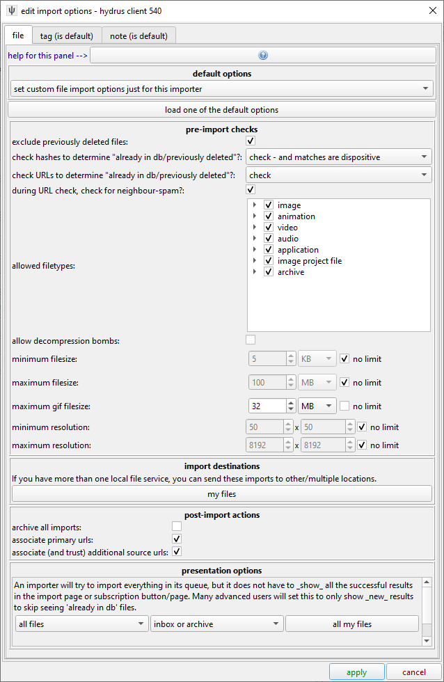
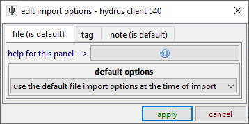
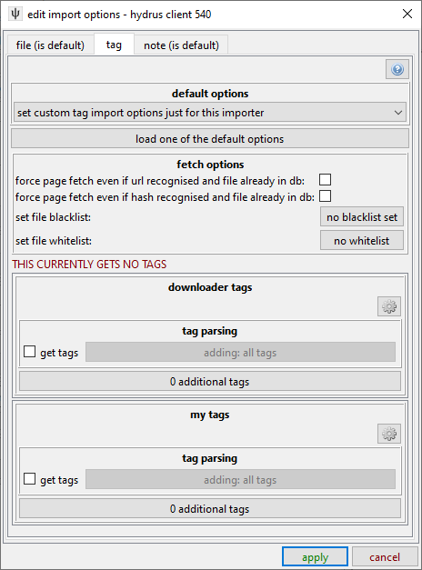
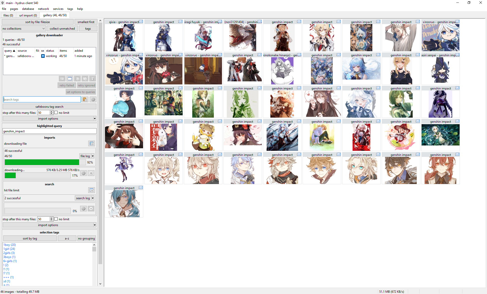
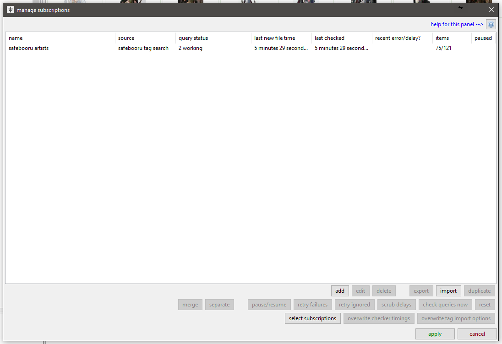
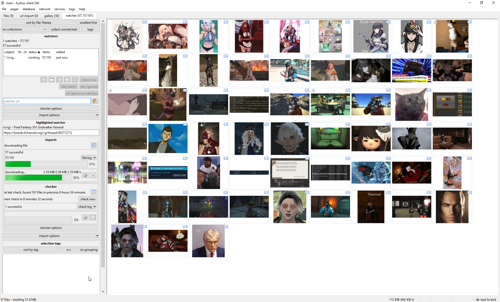
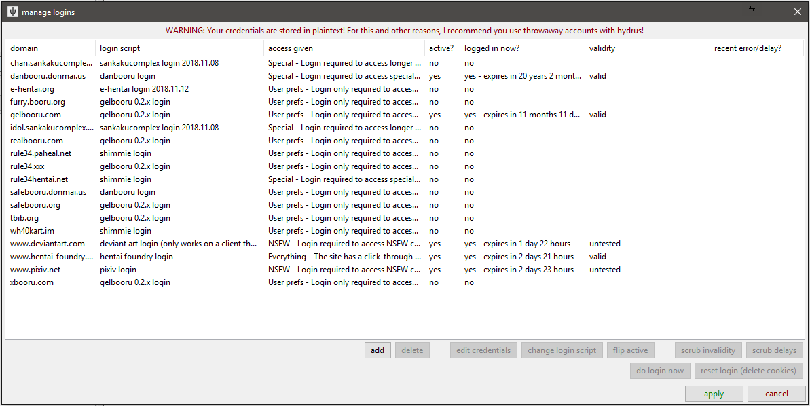

# Getting started with downloading

The hydrus client has a sophisticated and completely user-customisable download system. It can pull from any booru or regular gallery site or imageboard, and also from some special examples like twitter and tumblr. A single file or URL to massive imports, the downloader can handle it all. A fresh install will by default have support for the bigger sites, but it _is_ possible, with some work, for any user to [create a new shareable downloader](downloader_intro.md) for a new site.

The downloader is highly parallelisable, and while the default [bandwidth rules](#bandwidth) should stop you from running too hot and downloading so much at once that you annoy the servers you are downloading from, there are no brakes in the program on what you can get.

!!! danger
    It is very important that you take this slow. Many users get overexcited with their new ability to download 500,000 files _and then do so_, only discovering later that 98% of what they got was junk that they now have to wade through. Figure out what workflows work for you, how fast you process files, what content you _actually_ want, how much bandwidth and hard drive space you have, and prioritise and throttle your incoming downloads to match. If you can realistically only archive/delete filter 50 files a day, there is little benefit to downloading 500 new files a day. START SLOW.

It also takes a decent whack of CPU to import a file. You'll usually never notice this with just one hard drive import going, but if you have twenty different download queues all competing for database access and individual 0.1-second hits of heavy CPU work, you will discover your client starts to judder and lag. Keep it in mind, and you'll figure out what your computer is happy with. I also recommend you try to keep your total loaded files/urls to be under 20,000 to keep things snappy. Remember that you can pause your import queues, if you need to calm things down a bit.

## Downloader types
There are a number of different downloader types, each with its own purpose. This is a short summary of them:  
**URL download**
:    Intended for single posts or images. (Works with the [API](client_api.md))

**Gallery**
:    For big download jobs such as an artist's catalogue, everything with a given tag on a booru.

**Subscriptions**
:    Repeated gallery jobs, for keeping up to date with an artist or tag. Use gallery downloader to get everything and a subscription to keep updated.

**Watcher**
:    Imageboard thread downloader, such as 4chan, 8chan, and what else exists. (Works with the [API](client_api.md))

**Simple downloader**
:    Intended for simple one-off jobs like grabbing all linked images in a page.

## File import settings
File import settings has a number of options that deal with the files being downloaded and what should happen to them. There's a few more tickboxes if you turn on advanced mode

**Pre-import checks**
:    Pretty self-explanatory for the most part. If you want to redownload previously deleted files turning off `exclude previously deleted files` will have Hydrus ignore deletion status.

**Import destinations**
:    See [multiple file services](advanced_multiple_local_file_services.md), an advanced feature.

## Parsing
By default, hydrus now starts with a local tag service called 'downloader tags' and it will parse (get) all the tags from normal gallery sites and put them in this service. You don't have to do anything, you will get some decent tags. As you use the client, you will figure out which tags you like and where you want them. On the downloader page, click `tag import options`:

This is an important dialog, although you will not need to use it much. It governs which tags are parsed and where they go. To keep things easy to manage, a new downloader will refer to the 'default' tag import options for a website, but for now let's set some values just for this downloader:

You can see that each tag service on your client has a separate section. If you add the PTR, that will get a new box too. A new client is set to _get all tags_ for 'downloader tags' service. Things can get much more complicated. Have a play around with the options here as you figure things out. Most of the controls have tooltips or longer explainers in sub-dialogs, so don't be afraid to try things.

It is easy to get tens of thousands of tags by downloading this way. Different sites offer different kinds and qualities of tags, and the client's downloaders (which were designed by me, the dev, or a user) may parse all or only some of them. Many users like to just get everything on offer, but others only ever want, say, `creator`, `series`, and `character` tags. If you feel brave, click that 'all tags' button, which will take you into hydrus's advanced 'tag filter', which allows you to select which of the incoming list of tags will be added.

The blacklist button will let you skip downloading files that have certain tags (perhaps you would like to auto-skip all images with `gore`, `scat`, or `diaper`?), again using the tag filter, while the whitelist enables you to only allow files that have at least one of a set of tags. The 'additional tags' adds some fixed personal tags to all files coming in--for instance, you might like to add 'process into favourites' to your 'my tags' for some query you really like so you can find those files again later and process them separately. That little 'cog' icon button can also do some advanced things.

To edit the defaults, hit up _network->downloaders->manage default tag import options_. You should do this as you get a better idea of your preferences. You can set them for all file posts generally, all watchers, and for specific sites as well.

!!! warning
    The file limit and file/tag import options on the upper panel, if changed, will only apply to **new** queries. If you want to change the options for an existing queue, either do so on its highlight panel below or use the 'set options to queries' button.

## URL download
The **url downloader** works like the gallery downloader but does not do searches. You can paste downloadable URLs to it, and it will work through them as one list. Dragging and dropping recognisable URLs onto the client (e.g. from your web browser) will also spawn and use this downloader.

The button next to the input field lets you paste multiple URLs at once such as if you've copied from a document or browser bookmarks. The URLs need to be newline separated.

### API
If you use [API-connected](client_api.md) programs such as the Hydrus Companion, then any [non-watchable](downloader_url_classes.md#url_types) URLs sent to Hydrus through them will end up in an URL downloader page, the specifics depending on the program's settings. You can't use this to force Hydrus to download paged galleries since the URL downloader page doesn't support traversing to the next page, use the gallery downloader for this.

## Gallery download

The gallery page can download from multiple sources at the same time. Each entry in the list represents a basic combination of two things:

**Source**
:   The site you are getting from. Safebooru or Danbooru or Deviant Art or twitter or anywhere else. In the example image this is the button labelled `artstation artist lookup`.

**Query text**
:   Something like 'contrapposto' or 'blonde\_hair blue\_eyes' or an artist name like 'incase'. Whatever is searched on the site to return a list of ordered media. In the example image this is the text field with `artist username` in it.

So, when you want to start a new download, you first select the source with the button and then type in a query in the text box and hit enter. The download will soon start and fill in information, and thumbnails should stream in, just like the hard drive importer. The downloader typically works by walking through the search's gallery pages one by one, queueing up the found files for later download. There are several intentional delays built into the system, so do not worry if work seems to halt for a little while--you will get a feel for hydrus's 'slow persistent growth' style with experience.

Do a test download now, for fun! Pause its gallery search after a page or two, and then pause the file import queue after a dozen or so files come in.

The thumbnail panel can only show results from one queue at a time, so double-click on an entry to 'highlight' it, which will show its thumbs and also give more detailed info and controls in the 'highlighted query' panel. I encourage you to explore the highlight panel over time, as it can show and do quite a lot. Double-click again to 'clear' it.

It is a good idea to 'test' larger downloads, either by visiting the site itself for that query, or just waiting a bit and reviewing the first files that come in. Just make sure that you _are_ getting what you thought you would, whether that be verifying that the query text is correct or that the site isn't only giving you bloated gifs or other bad quality files. The 'file limit', which stops the gallery search after the set number of files, is also great for limiting fishing expeditions (such as overbroad searches like 'wide_hips', which on the bigger boorus have 100k+ results and return _variable_ quality). If the gallery search runs out of new files before the file limit is hit, the search will naturally stop (and the entry in the list should gain a ⏹ 'stop' symbol).

_Note that some sites only serve 25 or 50 pages of results, despite their indices suggesting hundreds. If you notice that one site always bombs out at, say, 500 results, it may be due to a decision on their end. You can usually test this by visiting the pages hydrus tried in your web browser._

**In general, particularly when starting out, artist searches are best.** They are usually fewer than a thousand files and have fairly uniform quality throughout.

## Subscriptions { id="subscriptions" }
Let's say you found an artist you like. You downloaded everything of theirs from some site, but every week, one or two new pieces is posted. You'd like to keep up with the new stuff, but you don't want to manually make a new download job every week for every single artist you like.

Subscriptions are a way to automatically recheck a good query in future, to keep up with new files. Many users come to use them. You set up a number of saved queries, and the client will 'sync' with the latest files in the gallery and download anything new, just as if you were running the download yourself.

Subscriptions only work for booru-like galleries that put the newest files first, and they only keep up with new content--once they have done their first sync, which usually gets the most recent hundred files or so, they will never reach further into the past. Getting older files, as you will see later, is a job best done with a normal download page.

!!! note
    The entire subscription system assumes the source is a typical 'newest first' booru-style search. If you dick around with some order_by:rating/random metatag, it will not work reliably.

It is important to note that while subscriptions can have multiple queries (even hundreds!), they _generally_ only work on one site. Expect to create one subscription for safebooru, one for artstation, one for paheal, and so on for every site you care about. Advanced users may be able to think of ways to get around this, but I recommend against it as it throws off some of the internal check timing calculations.

### Setting up subscriptions

Here's the dialog, which is under _network->manage subscriptions_:

This is a very simple example--there is only one subscription, for safebooru. It has two 'queries' (i.e. searches to keep up with).

Before we trip over the advanced buttons here, let's zoom in on the actual subscription:

!!! danger
    **Do not change the max number of new files options until you know _exactly_ what they do and have a good reason to alter them!**

This is a big and powerful panel! I recommend you open the screenshot up in a new browser tab, or in the actual client, so you can refer to it.

Despite all the controls, the basic idea is simple: Up top, I have selected the 'safebooru tag search' download source, and then I have added two artists--"hong_soon-jae" and "houtengeki". These two queries have their own panels for reviewing what URLs they have worked on and further customising their behaviour, but all they _really_ are is little bits of search text. When the subscription runs, it will put the given search text into the given download source just as if you were running the regular downloader.

!!! warning
    Subscriptions syncs are somewhat fragile. Do not try to play with the limits or checker options to download a whole 5,000 file query in one go--if you want everything for a query, run it in the manual downloader and get everything, then set up a normal sub for new stuff. There is no benefit to having a 'large' subscription, and it will trim itself down in time anyway.

You might want to put subscriptions off until you are more comfortable with galleries. There is more help [here](getting_started_subscriptions.md).

## Watchers
If you are an imageboard user, try going to a thread you like and drag-and-drop its URL (straight from your web browser's address bar) onto the hydrus client. It should open up a new 'watcher' page and import the thread's files!

With only one URL to check, watchers are a little simpler than gallery searches, but as that page is likely receiving frequent updates, it checks it over and over until it dies. By default, the watcher's 'checker options' will regulate how quickly it checks based on the speed at which new files are coming in--if a thread is fast, it will check frequently; if it is running slow, it may only check once per day. When a thread falls below a critical posting velocity or 404s, checking stops.

In general, you can leave the checker options alone, but you might like to revisit them if you are always visiting faster or slower boards and find you are missing files or getting DEAD too early.

### API
If you use [API-connected](client_api.md) programs such as the Hydrus Companion, then any [watchable](downloader_url_classes.md#url_types) URLs sent to Hydrus through them will end up in a watcher page, the specifics depending on the program's settings.

## Simple downloader
The **simple downloader** will do very simple parsing for unusual jobs. If you want to download all the images in a page, or all the image link destinations, this is the one to use. There are several default parsing rules to choose from, and if you learn the downloader system yourself, it will be easy to make more.

## Bandwidth

It will not be too long until you see a "bandwidth free in xxxxx..." message. As a long-term storage solution, hydrus is designed to be polite in its downloading--both to the source server and your computer. The client's default bandwidth rules have some caps to stop big mistakes, spread out larger jobs, and at a bare minimum, no domain will be hit more than once a second.

All the bandwidth rules are completely customisable and are found in `network > data > review bandwidth usage and edit rules`. They can get quite complicated. I **strongly** recommend you not look for them until you have more experience. I **especially strongly** recommend you not ever turn them all off, thinking that will improve something, as you'll probably render the client too laggy to function and get yourself an IP ban from the next server you pull from.

If you want to download 10,000 files, set up the queue and let it work. The client will take breaks, likely even to the next day, but it will get there in time. Many users like to leave their clients on all the time, just running in the background, which makes these sorts of downloads a breeze--you check back in the evening and discover your download queues, watchers, and subscriptions have given you another thousand things to deal with.

Again: the real problem with downloading is not finding new things, it is keeping up with what you get. Start slow and figure out what is important to your bandwidth budget, hard drive budget, and free time budget. Almost everyone fails at this.

## Logins

The client now supports a flexible (but slightly prototype and ugly) login system. It can handle simple sites and is as [completely user-customisable as the downloader system](downloader_login.md). The client starts with multiple login scripts by default, which you can review under _network->logins->manage logins_:

Many sites grant all their content without you having to log in at all, but others require it for NSFW or special content, or you may wish to take advantage of site-side user preferences like personal blacklists. If you wish, you can give hydrus some login details here, and it will try to login--just as a browser would--before it downloads anything from that domain.

!!! warning
    For multiple reasons, I do not recommend you use important accounts with hydrus. Use a throwaway account you don't care much about.

To start using a login script, select the domain and click 'edit credentials'. You'll put in your username/password, and then 'activate' the login for the domain, and that should be it! The next time you try to get something from that site, the first request will wait (usually about ten seconds) while a login popup performs the login. Most logins last for about thirty days (and many refresh that 30-day timer every time you make a new request), so once you are set up, you usually never notice it again, especially if you have a subscription on the domain.

Most sites only have one way of logging in, but hydrus does support more. Hentai Foundry is a good example--by default, the client performs the 'click-through' login as a guest, which requires no credentials and means any hydrus client can get any content from the start. But this way of logging in only lasts about 60 minutes or so before having to be refreshed, and it does not hide any spicy stuff, so if you use HF a lot, I recommend you create a throwaway account, set the filters you like in your HF profile (e.g. no guro content), and then click the 'change login script' in the client to the proper username/pass login.

The login system is new and still a bit experimental. Don't try to pull off anything too weird with it! If anything goes wrong, it will likely delay the script (and hence the whole domain) from working for a while, or invalidate it entirely. If the error is something simple, like a password typo or current server maintenance, go back to this dialog to fix and scrub the error and try again. If the site just changed its layout, you may need to update the login script. If it is more complicated, please contact me, hydrus_dev, with the details!

If you would like to login to a site that is not yet supported by hydrus (usually ones with a Captcha in the login page), see about getting a web browser add-on that lets you export a cookies.txt (either for the whole browser or just for that domain) and then drag and drop that file onto the hydrus _network->data->review session cookies_ dialog. This sometimes does not work if your add-on's export formatting is unusual. If it does work, hydrus will import and use those cookies, which skips the login by making your hydrus pretend to be your browser directly. This is obviously advanced and hacky, so if you need to do it, let me know how you get on and what tools you find work best!
